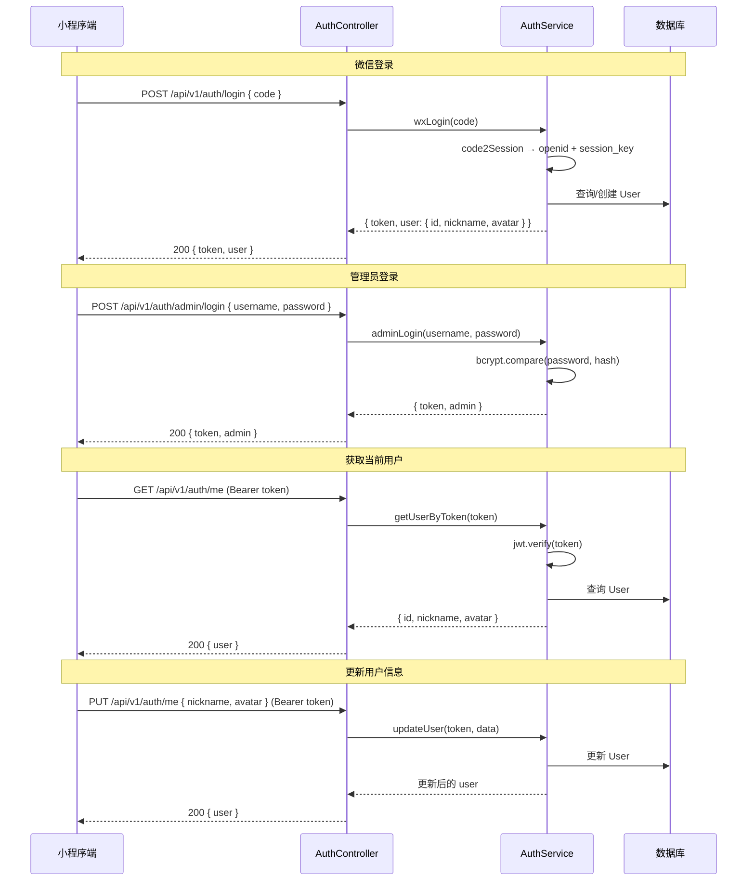
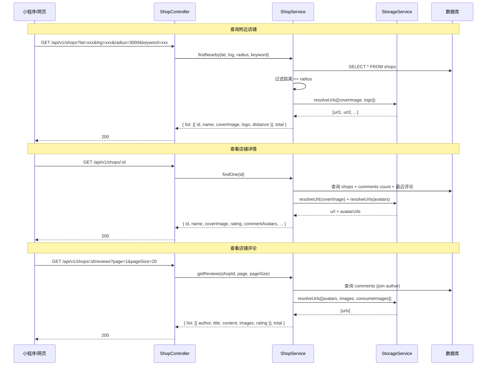
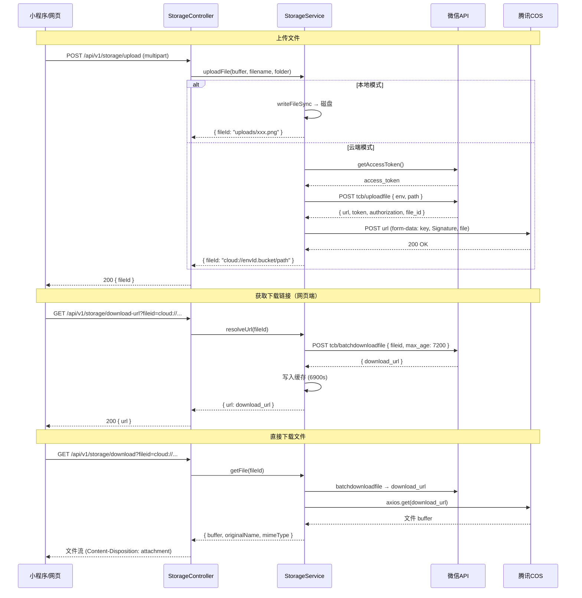
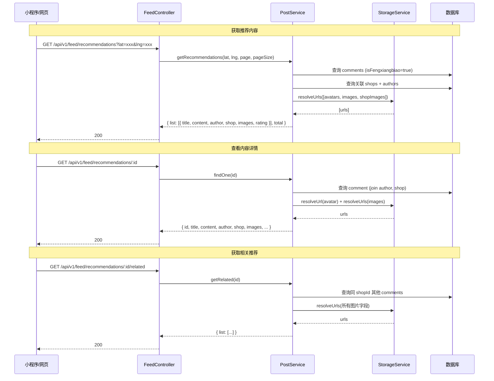
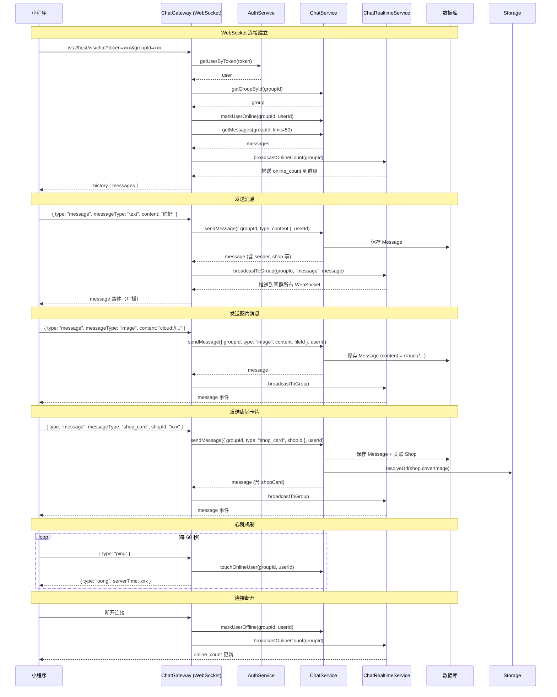
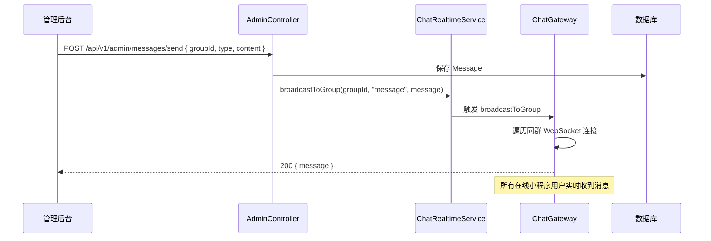
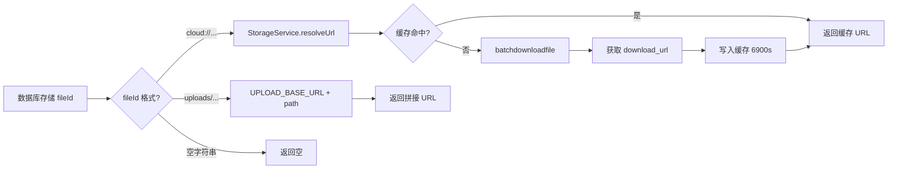
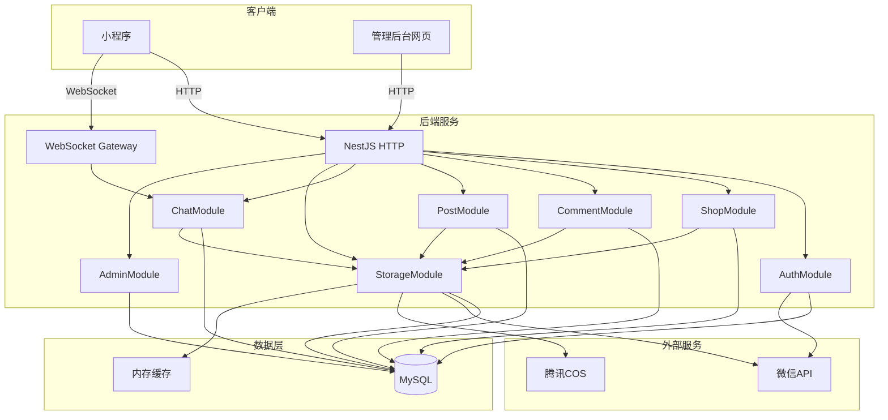

# Finder 业务流程图

## 一、用户认证

```mermaid
sequenceDiagram
    participant 小程序 as 小程序端
    participant Auth as AuthController
    participant Service as AuthService
    participant DB as 数据库

    Note over 小程序,DB: 微信登录
    小程序->>Auth: POST /api/v1/auth/login { code }
    Auth->>Service: wxLogin(code)
    Service->>Service: code2Session → openid + session_key
    Service->>DB: 查询/创建 User
    Service-->>Auth: { token, user: { id, nickname, avatar } }
    Auth-->>小程序: 200 { token, user }

    Note over 小程序,DB: 管理员登录
    小程序->>Auth: POST /api/v1/auth/admin/login { username, password }
    Auth->>Service: adminLogin(username, password)
    Service->>Service: bcrypt.compare(password, hash)
    Service-->>Auth: { token, admin }
    Auth-->>小程序: 200 { token, admin }

    Note over 小程序,DB: 获取当前用户
    小程序->>Auth: GET /api/v1/auth/me (Bearer token)
    Auth->>Service: getUserByToken(token)
    Service->>Service: jwt.verify(token)
    Service->>DB: 查询 User
    Service-->>Auth: { id, nickname, avatar }
    Auth-->>小程序: 200 { user }

    Note over 小程序,DB: 更新用户信息
    小程序->>Auth: PUT /api/v1/auth/me { nickname, avatar } (Bearer token)
    Auth->>Service: updateUser(token, data)
    Service->>DB: 更新 User
    Service-->>Auth: 更新后的 user
    Auth-->>小程序: 200 { user }
```

---

## 二、店铺

```mermaid
sequenceDiagram
    participant 用户 as 小程序/网页
    participant Shop as ShopController
    participant Service as ShopService
    participant Storage as StorageService
    participant DB as 数据库

    Note over 用户,DB: 查询附近店铺
    用户->>Shop: GET /api/v1/shops?lat=xxx&lng=xxx&radius=3000&keyword=xxx
    Shop->>Service: findNearby(lat, lng, radius, keyword)
    Service->>DB: SELECT * FROM shops
    Service->>Service: 过滤距离 <= radius
    Service->>Storage: resolveUrls([coverImage, logo])
    Storage-->>Service: [url1, url2, ...]
    Service-->>Shop: { list: [{ id, name, coverImage, logo, distance }], total }
    Shop-->>用户: 200

    Note over 用户,DB: 查看店铺详情
    用户->>Shop: GET /api/v1/shops/:id
    Shop->>Service: findOne(id)
    Service->>DB: 查询 shops + comments count + 最近评论
    Service->>Storage: resolveUrl(coverImage) + resolveUrls(avatars)
    Storage-->>Service: url + avatarUrls
    Service-->>Shop: { id, name, coverImage, rating, commentAvatars, ... }
    Shop-->>用户: 200

    Note over 用户,DB: 查看店铺评论
    用户->>Shop: GET /api/v1/shops/:id/reviews?page=1&pageSize=20
    Shop->>Service: getReviews(shopId, page, pageSize)
    Service->>DB: 查询 comments (join author)
    Service->>Storage: resolveUrls([avatars, images, consumeImages])
    Storage-->>Service: [urls]
    Service-->>Shop: { list: [{ author, title, content, images, rating }], total }
    Shop-->>用户: 200
```

---

## 三、文件上传下载

```mermaid
sequenceDiagram
    participant 客户端 as 小程序/网页
    participant Storage as StorageController
    participant Service as StorageService
    participant WX as 微信API
    participant COS as 腾讯COS

    Note over 客户端,COS: 上传文件
    客户端->>Storage: POST /api/v1/storage/upload (multipart)
    Storage->>Service: uploadFile(buffer, filename, folder)
    
    alt 本地模式
        Service->>Service: writeFileSync → 磁盘
        Service-->>Storage: { fileId: "uploads/xxx.png" }
    else 云端模式
        Service->>WX: getAccessToken()
        WX-->>Service: access_token
        Service->>WX: POST tcb/uploadfile { env, path }
        WX-->>Service: { url, token, authorization, file_id }
        Service->>COS: POST url (form-data: key, Signature, file)
        COS-->>Service: 200 OK
        Service-->>Storage: { fileId: "cloud://envId.bucket/path" }
    end
    Storage-->>客户端: 200 { fileId }

    Note over 客户端,COS: 获取下载链接（网页端）
    客户端->>Storage: GET /api/v1/storage/download-url?fileid=cloud://...
    Storage->>Service: resolveUrl(fileId)
    Service->>WX: POST tcb/batchdownloadfile { fileid, max_age: 7200 }
    WX-->>Service: { download_url }
    Service->>Service: 写入缓存 (6900s)
    Service-->>Storage: { url: download_url }
    Storage-->>客户端: 200 { url }

    Note over 客户端,COS: 直接下载文件
    客户端->>Storage: GET /api/v1/storage/download?fileid=cloud://...
    Storage->>Service: getFile(fileId)
    Service->>WX: batchdownloadfile → download_url
    Service->>COS: axios.get(download_url)
    COS-->>Service: 文件 buffer
    Service-->>Storage: { buffer, originalName, mimeType }
    Storage-->>客户端: 文件流 (Content-Disposition: attachment)
```

---

## 四、内容信息流

```mermaid
sequenceDiagram
    participant 用户 as 小程序/网页
    participant Feed as FeedController
    participant Post as PostService
    participant Storage as StorageService
    participant DB as 数据库

    Note over 用户,DB: 获取推荐内容
    用户->>Feed: GET /api/v1/feed/recommendations?lat=xxx&lng=xxx
    Feed->>Post: getRecommendations(lat, lng, page, pageSize)
    Post->>DB: 查询 comments (isFengxiangbiao=true)
    Post->>DB: 查询关联 shops + authors
    Post->>Storage: resolveUrls([avatars, images, shopImages])
    Storage-->>Post: [urls]
    Post-->>Feed: { list: [{ title, content, author, shop, images, rating }], total }
    Feed-->>用户: 200

    Note over 用户,DB: 查看内容详情
    用户->>Feed: GET /api/v1/feed/recommendations/:id
    Feed->>Post: findOne(id)
    Post->>DB: 查询 comment (join author, shop)
    Post->>Storage: resolveUrl(avatar) + resolveUrls(images)
    Storage-->>Post: urls
    Post-->>Feed: { id, title, content, author, shop, images, ... }
    Feed-->>用户: 200

    Note over 用户,DB: 获取相关推荐
    用户->>Feed: GET /api/v1/feed/recommendations/:id/related
    Feed->>Post: getRelated(id)
    Post->>DB: 查询同 shopId 其他 comments
    Post->>Storage: resolveUrls(所有图片字段)
    Storage-->>Post: urls
    Post-->>Feed: { list: [...] }
    Feed-->>用户: 200
```

---

## 五、聊天系统

```mermaid
sequenceDiagram
    participant 客户端 as 小程序
    participant GW as ChatGateway (WebSocket)
    participant Auth as AuthService
    participant Chat as ChatService
    participant RT as ChatRealtimeService
    participant DB as 数据库

    Note over 客户端,DB: WebSocket 连接建立
    客户端->>GW: ws://host/ws/chat?token=xxx&groupId=xxx
    GW->>Auth: getUserByToken(token)
    Auth-->>GW: user
    GW->>Chat: getGroupById(groupId)
    Chat-->>GW: group
    GW->>Chat: markUserOnline(groupId, userId)
    GW->>Chat: getMessages(groupId, limit=50)
    Chat-->>GW: messages
    GW->>RT: broadcastOnlineCount(groupId)
    RT-->>GW: 推送 online_count 到群组
    GW-->>客户端: history { messages }

    Note over 客户端,DB: 发送消息
    客户端->>GW: { type: "message", messageType: "text", content: "你好" }
    GW->>Chat: sendMessage({ groupId, type, content }, userId)
    Chat->>DB: 保存 Message
    Chat-->>GW: message (含 sender, shop 等)
    GW->>RT: broadcastToGroup(groupId, "message", message)
    RT-->>GW: 推送到同群所有 WebSocket
    GW-->>客户端: message 事件（广播）

    Note over 客户端,DB: 发送图片消息
    客户端->>GW: { type: "message", messageType: "image", content: "cloud://..." }
    GW->>Chat: sendMessage({ groupId, type: "image", content: fileId }, userId)
    Chat->>DB: 保存 Message (content = cloud://...)
    Chat-->>GW: message
    GW->>RT: broadcastToGroup
    RT-->>客户端: message 事件

    Note over 客户端,DB: 发送店铺卡片
    客户端->>GW: { type: "message", messageType: "shop_card", shopId: "xxx" }
    GW->>Chat: sendMessage({ groupId, type: "shop_card", shopId }, userId)
    Chat->>DB: 保存 Message + 关联 Shop
    Chat->>Storage: resolveUrl(shop.coverImage)
    Chat-->>GW: message (含 shopCard)
    GW->>RT: broadcastToGroup
    RT-->>客户端: message 事件

    Note over 客户端,DB: 心跳机制
    loop 每 60 秒
        客户端->>GW: { type: "ping" }
        GW->>Chat: touchOnlineUser(groupId, userId)
        GW-->>客户端: { type: "pong", serverTime: xxx }
    end

    Note over 客户端,DB: 连接断开
    客户端->>GW: 断开连接
    GW->>Chat: markUserOffline(groupId, userId)
    GW->>RT: broadcastOnlineCount(groupId)
    RT-->>客户端: online_count 更新
```

---

## 六、管理后台（Admin）

```mermaid
flowchart TD
    A[管理后台] --> B[认证: POST /auth/admin/login]
    A --> C[用户管理]
    A --> D[商家管理]
    A --> E[评论管理]
    A --> F[消息管理]
    A --> G[群组管理]
    A --> H[管理员管理]

    C --> C1[GET /admin/users - 分页列表]
    C --> C2[POST /admin/users - 创建]
    C --> C3[PUT /admin/users/:id - 更新]
    C --> C4[DELETE /admin/users/:id - 删除]

    D --> D1[GET /admin/shops - 分页列表]
    D --> D2[POST /admin/shops - 创建]
    D --> D3[PUT /admin/shops/:id - 更新]
    D --> D4[DELETE /admin/shops/:id - 删除]

    E --> E1[GET /admin/comments - 分页列表]
    E --> E2[GET /admin/comments/:id - 详情]
    E --> E3[POST /admin/comments - 创建]
    E --> E4[PUT /admin/comments/:id - 更新]
    E --> E5[DELETE /admin/comments/:id - 删除]

    F --> F1[GET /admin/messages - 消息列表]
    F --> F2[POST /admin/messages/send - 发送消息]
    F --> F3[DELETE /admin/messages/:id - 删除消息]

    G --> G1[GET /admin/chat-groups - 群组列表]
    G --> G2[POST /admin/chat-groups - 创建群组]
    G --> G3[GET /admin/chat-groups/:id/online-users - 在线用户]
    G --> G4[DELETE /admin/chat-groups/:id/online-users/:userId - 踢出用户]

    H --> H1[GET /admin/admins - 管理员列表]
    H --> H2[POST /admin/admins - 创建管理员]
    H --> H3[PUT /admin/admins/:id - 更新]
    H --> H4[DELETE /admin/admins/:id - 删除]
```

### 管理员发送消息流程

```mermaid
sequenceDiagram
    participant 管理员 as 管理后台
    participant Admin as AdminController
    participant RT as ChatRealtimeService
    participant GW as ChatGateway
    participant DB as 数据库

    管理员->>Admin: POST /api/v1/admin/messages/send { groupId, type, content }
    Admin->>DB: 保存 Message
    Admin->>RT: broadcastToGroup(groupId, "message", message)
    RT->>GW: 触发 broadcastToGroup
    GW->>GW: 遍历同群 WebSocket 连接
    GW-->>管理员: 200 { message }
    Note over GW: 所有在线小程序用户实时收到消息
```

---

## 七、图片字段解析流程

```mermaid
flowchart LR
    A[数据库存储 fileId] --> B{fileId 格式?}
    B -->|cloud://...| C[StorageService.resolveUrl]
    B -->|uploads/...| D[UPLOAD_BASE_URL + path]
    B -->|空字符串| E[返回空]

    C --> F{缓存命中?}
    F -->|是| G[返回缓存 URL]
    F -->|否| H[batchdownloadfile]
    H --> I[获取 download_url]
    I --> J[写入缓存 6900s]
    J --> G

    D --> K[返回拼接 URL]
```

---

## 八、全局架构

```mermaid
flowchart TB
    subgraph 客户端
        MP[小程序]
        WEB[管理后台网页]
    end

    subgraph 后端服务
        GW_HTTP[NestJS HTTP]
        GW_WS[WebSocket Gateway]
        Auth[AuthModule]
        Shop[ShopModule]
        Comment[CommentModule]
        Post[PostModule]
        Chat[ChatModule]
        Storage[StorageModule]
        Admin[AdminModule]
    end

    subgraph 外部服务
        WX_API[微信API]
        COS[腾讯COS]
    end

    subgraph 数据层
        DB[(MySQL)]
        CACHE[内存缓存]
    end

    MP -->|HTTP| GW_HTTP
    MP -->|WebSocket| GW_WS
    WEB -->|HTTP| GW_HTTP

    GW_HTTP --> Auth
    GW_HTTP --> Shop
    GW_HTTP --> Comment
    GW_HTTP --> Post
    GW_HTTP --> Chat
    GW_HTTP --> Storage
    GW_HTTP --> Admin

    GW_WS --> Chat

    Auth --> DB
    Shop --> DB
    Shop --> Storage
    Comment --> DB
    Comment --> Storage
    Post --> DB
    Post --> Storage
    Chat --> DB
    Chat --> Storage
    Admin --> DB
    Storage --> DB
    Storage --> WX_API
    Storage --> COS
    Storage --> CACHE

    Auth --> WX_API
```
