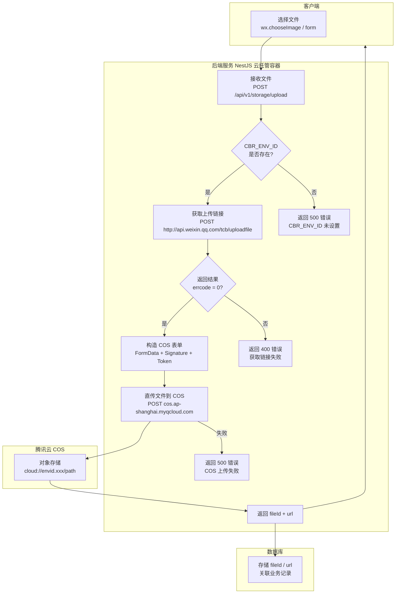
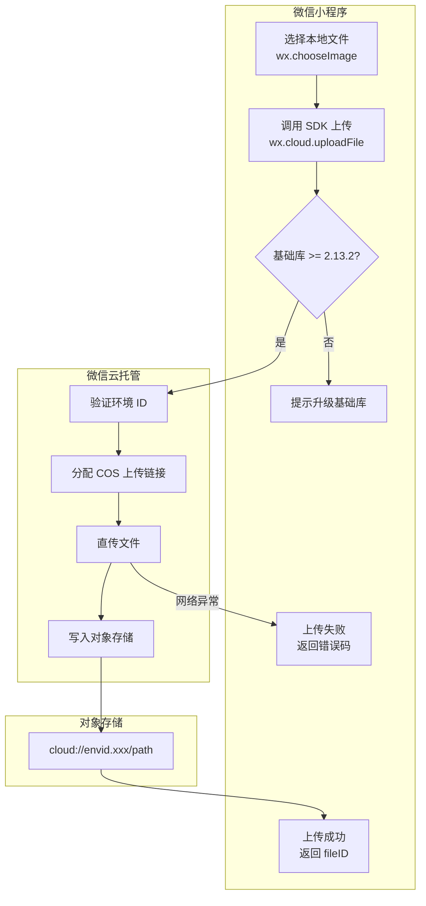
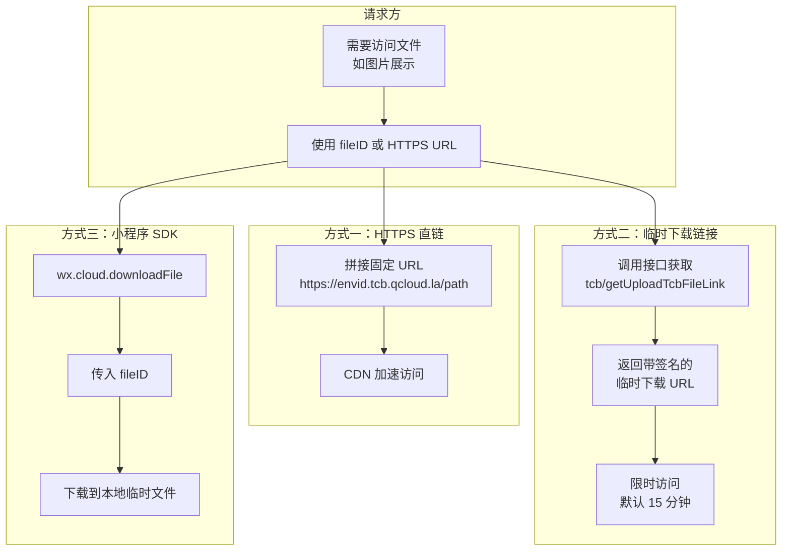
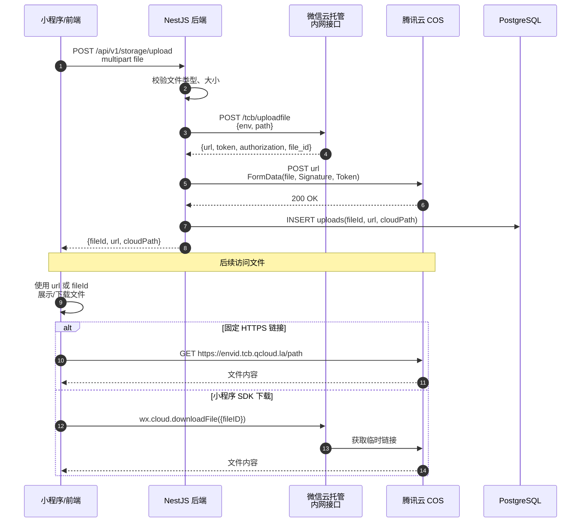
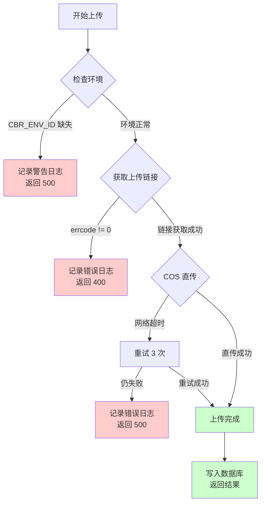

# 微信云托管文件上传下载流程图

> 基于服务端两阶段上传与小程序直传的完整链路

---

## 一、服务端上传流程（两阶段）

**关键步骤说明**

1. **阶段一：获取上传链接** — 后端调用微信内网接口 `http://api.weixin.qq.com/tcb/uploadfile`，传入环境 ID 和目标路径，返回 COS 临时上传地址、签名和 Token
2. **阶段二：直传 COS** — 后端构造 multipart/form-data 请求，将文件直接上传至腾讯云 COS，不经过后端中转文件流
3. **免鉴权** — 云托管容器内调用微信接口无需 access_token，自动识别环境身份

---

## 二、小程序直传流程

**与后端上传的区别**

- 小程序端 SDK 自动完成「获取链接 + COS 上传」两阶段，开发者无需关心内部实现
- 适合用户直接上传场景（如头像、图片发布），减少后端带宽消耗
- 大文件或需要业务校验的场景，建议先传后端再转存

---

## 三、文件下载/访问流程

**三种访问方式对比**

| 方式 | 适用场景 | 有效期 | 权限控制 |
|------|----------|--------|----------|
| HTTPS 固定链接 | 公开资源（头像、封面图） | 永久 | 公开访问 |
| 临时下载链接 | 私有文件（合同、身份证） | 15 分钟 | 签名鉴权 |
| 小程序 SDK | 小程序内部下载 | 一次性 | 微信生态鉴权 |

---

## 四、完整业务时序图

---

## 五、错误处理流程

